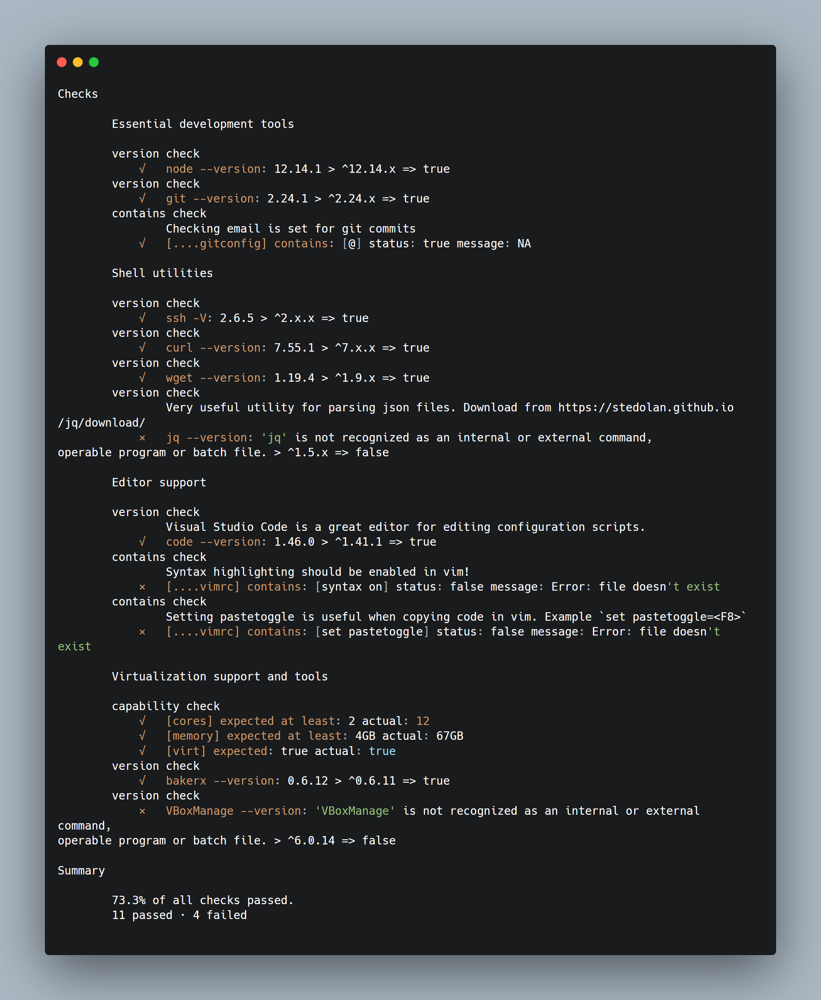

# Opunit

[opunit](https://github.com/ottomatica/opunit) is a simple tool for verifying the configuration of a machine, including your laptop and or any virtual machines you may have created.

By running opunit, you'll be able to verify your machine is correctly setup for a course, workshop, or homework assignment. 

In the simpliest case, opunit can check if you have the right versions of software installed. Beyond these simple checks, opunit can also verify the correct configuration of software and services that you'll be automating later in the course.

### Installing opunit

opunit requires [node.js](https://nodejs.org/en/) to be installed.

You can then install using npm:

```bash
npm install opunit -g
```

### Checking your local machine

You can check your local machine against a course profile, but running the following command:

```bash
opunit profile CSC-DevOps/profile:519.yml
```

The resulting output might look something like this image below. The green check ✔️ indicates that a check was passed, while the red x ❌ indicates that a check failed.

For example, the first check will validate whether the version of node.js satisties the semver requirement of being at least `^10.x.x` or greater.

Notice that one of the checks under "Editor Support", fails to validate. This check looks for syntax highlighting being enabled for vim. This check fails because the .vimrc file is not presence on system.

If you have any questions about why a check fails or passes on your system, reach out to a TA or instructor.



### Running opunit for a workshop/assignment

You run opunit against a local profile, which is useful when working on an assignment or workshop.

For example, if you are working on the [Pipelines workshop](https://github.com/CSC-DevOps/Pipelines), you can run opunit against the profile located in test/opunit.yml

```bash
opunit verify local
```

This will check whether you have correctly setup your pipeline for the workshop. Before doing anything, it would be expected for most checks to fail. As you complete more steps from the workshop, more checks should pass!


### Running opunit against a virtual machine

opunit can be run against a virtual machine, both locally on your machine, as well as remote virtual machines created on platforms such as AWS or digital ocean.

Further instructions will be provided when we get to this step.